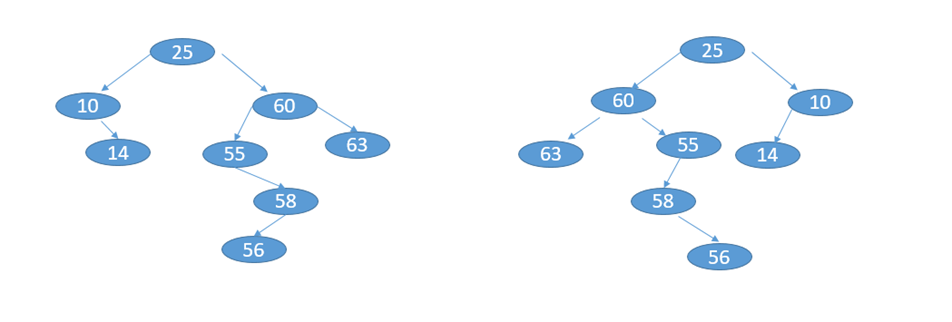

# Problem 1

## Phase 0: Requirements

It's gotta print the binary tree sideways.  with indentation for each level of the nodes

**What info will the recursive call need?**
* the depth of the call
* the node to be added

## Phase 1: System Analysis

**What algorithms?**


## Phase 2: Design

It will need to do an `in-order traversal` and with each
`node` it finds the depth and appends `depth * " " + node` that to the return string

```
  14
 11
10
   9
  8
   7
 6
  5
```

pseudocode
```java

private String toString(Node<E> t, String indent) {
        if (t == null) return "";
        StringBuilder sb = new StringBuilder();
        sb.append toString(t.right, indent + " ") + "\n"
        sb.append indent + t.element.toString() + "\n"
        sb.append toString(t.right, indent + " ") + "\n"
        return sb.toString();
    
    
        }


```


# Problem 2

## Phase 0: Requirements

flip the children



## Phase 1: System Analysis

## Phase 2: Design

```java
public void flip(node<E> t){
        if (t == null) return
        flip the children of t
        flip(t.left)
        flip(t.right)
        }


```


# Problem 3

## Phase 0: Requirements

## Phase 1: System Analysis

## Phase 2: Design
```java

private NodeInfo deepestNode(BinaryNode<E> node, int depth){
        NodeInfo leftBiggest;
        NodeInfo rightBigeest;
        if (node.left){
            leftBiggest =  = deepestNode(node.left, depth+1)
        }
        if (node.right){
            rightBiggeset =  = deepestNode(node.left, depth+1)
        }
        if (leftBiggest && rightBiggest){
            return biggest of the two
        }
        else if(leftBiggest || rightBiggest){
            return the one that continues
        }
        else
            return the root node, // no children
    }
```

# Problem 4

## Phase 0: Requirements

## Phase 1: System Analysis

## Phase 2: Design
```java
public int nodesInLevel(node, target, depth){
    if(node == null) return 0;
    if(depth > target) return 0;
    if(depth == target) return 1;
    int left = nodesInlevel(node.left, target, depth + 1)
    int right = nodesInlevel(node.right, target, depth + 1)
    return left + right;
        }
```

# Problem 5

## Phase 0: Requirements

## Phase 1: System Analysis

## Phase 2: Design
I will pass in a all the node elements and print all of them once I get to each leaf

```java
    private void printAllPaths(BinaryNode<E> node, String toPrint){
        toPrint.append(node.element)
        if(node.left == null && node.right == null){
            System.out.print(toPrint)
        }
        if(node.left != null){
        printAllPaths(node.left, toPrint)
        }
        if(node.right != null){
        printAllPaths(node.right, toPrint)
        }
        }


```
# Problem 6

## Phase 0: Requirements

## Phase 1: System Analysis

## Phase 2: Design

check the left and right children to see if they add up to `k` 
if they don't remove the child

```java
public int prune(BinaryNode<E> node, Integer TARGETSUM, int pathSum){
    if(node == null) return pathSum
    pathsum = pathsum + node.element
    if(prune(node.left, TARGETSUM, pathsum) < TARGET_SUM){  // left child is too small
        node.left = null;
        }
    if(prune(node.right, TARGETSUM, pathsum) < TARGETSUM) { // right child is too small
        node.right = null;
        }
    
        }
```

# Problem 7

## Phase 0: Requirements

## Phase 1: System Analysis

## Phase 2: Design


# Problem 8

## Phase 0: Requirements

## Phase 1: System Analysis

## Phase 2: Design


# Problem 9

## Phase 0: Requirements

## Phase 1: System Analysis

## Phase 2: Design


# Problem 10

## Phase 0: Requirements

## Phase 1: System Analysis

## Phase 2: Design
